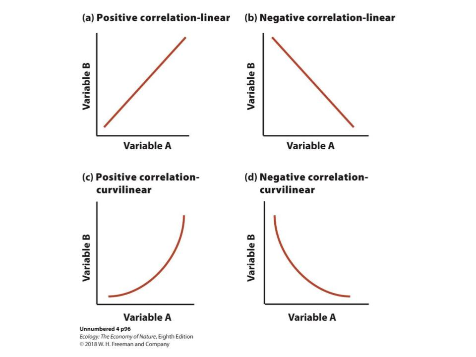

<div style = "margin-bottom:75px;">

</div>

<div style = "margin-bottom:50px;">

A **correlation** is a statistical description of 

</div>

```{r bio239 line 15, echo = FALSE, fig.cap = "Correlations. (a) When an increase in one variable is associated with a linear increase in another variable, it's a positive linear correlation. (b) When an increase in one variable is associated with a linear decrease in another variable, it's a negative linear correlation. (c) Positive and curvilinear. (d) Negative and curvilinear.", out.width = '75%'}

```