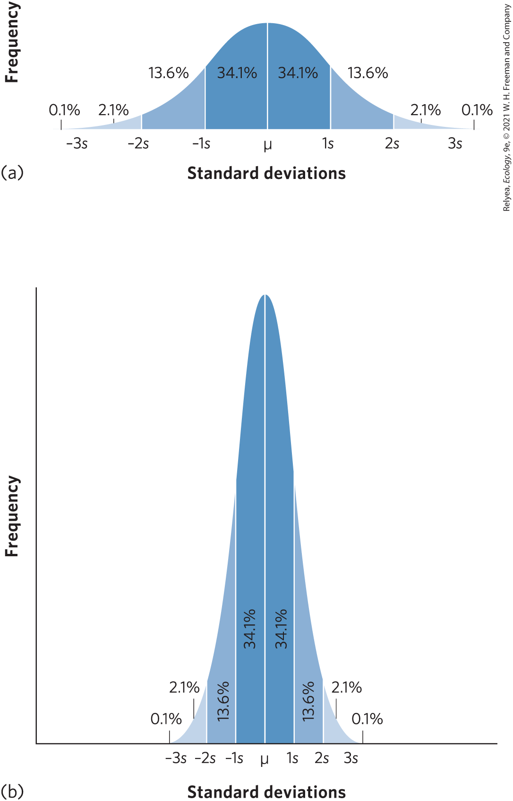

```{r bio239 line 5, include = FALSE, echo = FALSE}
require(tidyverse)
```

<div style = "margin-bottom:25px;">
From pages **72 & 73** in the textbook
</div>

<div style = "margin-bottom:25px;">
When the researchers tested the effects of road salt on larval amphibians, they exposed groups of larvae to three salt concentrations and replicated the experiment five times. In a previous chapter, we discussed how ecologists use data from such manipulative experiments to determine how different factors affect the means and variance of the variables that are measured. While the variance is a useful measure of how consistent measurements are among replicates, ecologists also use several other related measures of variation, including the sample standard deviation and the standard error of the mean. Each of these can be calculated from a measure of sample variance ($s^2$), as we discussed in Chapter 1.
</div>

<div style = "margin-bottom:25px;">
When data are collected from limited samples of a much larger distribution of data, we can gain additional information about the data by calculating a sample standard deviation. The **sample standard deviation** gives us a standardized way of measuring how widely our data are spread from the mean. Large sample standard deviations indicate that many of our data are spread far from the mean. Small sample standard deviations indicate that most of our data points are close to the mean value.
</div>

<div style = "margin-bottom:25px;">
If data are normally distributed—that is, if they follow a bell-shaped curve like the one in the figure at the right—then about 68 percent of our data will fall within 1 standard deviation of the mean. Moreover, about 95 percent of our data will fall within 2 standard deviations of the mean and 99.7 percent of our data will fall within 3 standard deviations of the mean. For data that have a wide distribution of frequencies, as in the upper figure (a), the standard deviation value will be large. For data that have a narrow distribution of frequencies, as in the lower figure (b), the standard deviation value will be small.
</div>

```{r bio239 line 25, echo = FALSE, fig.cap = "The normal distribution. In a normal distribution, the most frequent observations fall near the mean and the least frequent observations occur farther away from the mean. The dark blue areas represent 1 standard deviation from the mean and account for 68.3 percent of all data. The medium and dark blue areas combined represent 2 standard deviations from the mean and account for 95.5 percent of all data. The light, medium, and dark blue areas combined represent 3 standard deviations from the mean and account for 99.7 percent of all data. The remaining small amount of data falls outside of 3 standard deviations. (a) Data that have a wide distribution have a large standard deviation. (b) Data that have a narrow distribution have a small standard deviation.", out.width = '50%'}

```

<div style = "margin-bottom:25px;">
The sample standard deviation, denoted as $s$, is defined as the square root of the sample variance:
</div>

<div style = "margin-bottom:25px;">
$s = \sqrt{s^{2}}$
</div>

<div style = "margin-bottom:25px;">
The **standard error of the mean** is a useful measurement of variation in our data because it takes into account the number of replicates that were used to measure the standard deviation. The higher the number of replicates, the more precise the estimate we should have of the mean. As a result, an increase in the number of replicates in a given experiment produces a decrease in the standard error of the mean. As we will see in later chapters, the standard error of the mean is commonly used to determine whether two means are significantly different from each other.
</div>

<div style = "margin-bottom:25px;">
Consider the following set of observations on the percentage of surviving wood frog tadpoles that were exposed to salt concentrations of 0 $μS$ or 3,000 $μS$:
</div>

<div style = "margin-bottom:25px;">
$SE = s / \sqrt{n}$
</div>

<div style = "margin-bottom:25px;">
Using the data from the five replicates that exposed wood frog tadpoles to 0 $μS$, we see that the mean survival is 91 percent and the sample variance is 5 percent. Using this sample variance, we can calculate the **sample standard deviation** as:
</div>

<div style = "margin-bottom:25px;">
$s = \sqrt{s^{2}} = \sqrt{5} = 2.2$
</div>

<div style = "margin-bottom:25px;">
$SE = s / \sqrt{n} = 2.2 / \sqrt{5} = 1.0$
</div>

```{r table1 line 61, echo = FALSE, message = FALSE, warnings = FALSE, results ='asis'}
tabl <- "
|Replicate|0 mu S|3,000 mu S| 
|:-:|:-:|:-:|
| 1 | 88 | 32 |           
| 2 | 90 | 37 |          
| 3 | 91 | 41 |        
| 4 | 92 | 45 |        
| 5 | 94 | 50 |  
| Mean | 91 | 41 | 
| Variance | 5.0 | 48.5 | 
"
cat(tabl)
```

<div style = "margin-bottom:25px;">
**In-class (group) Questions**
</div>

<div style = "margin-bottom:25px;">
1. Use the data collected from the five replicates that exposed wood frog tadpoles to 3,000 $µS$ and calculate the standard deviation of the mean and the standard error of the mean.
</div>

<div style = "margin-bottom:25px;">
2. Why do the values of $s$ and $SE$ differ?
</div>

<div style = "margin-bottom:25px;">
3. Given that the maximum survival value is 100 percent, why is the variance value for the control treatment likely to be lower than any salt treatment that causes moderate amounts of mortality?
</div>


